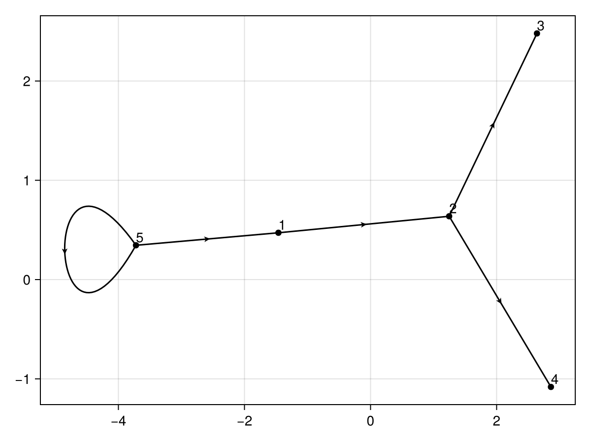

# OrganizationalGraphs

[](https://tp2750.github.io/OrganizationalGraphs.jl/stable/)
[](https://tp2750.github.io/OrganizationalGraphs.jl/dev/)
[](https://github.com/tp2750/OrganizationalGraphs.jl/actions/workflows/CI.yml?query=branch%3Amain)



``` julia
using OrganizationalGraphs
using DataFrames

org1 = DataFrame("employee" => ["A", "B", "C", "D", "T"], "manager" => ["T", "A", "B", "B","T"])
org_depth(org1)

5×4 DataFrame
 Row │ employee  manager  index     org_depth 
     │ String    String   Integer?  Float64?  
─────┼────────────────────────────────────────
   1 │ A         T               1        1.0
   2 │ B         A               2        2.0
   3 │ C         B               3        3.0
   4 │ D         B               4        3.0
   5 │ T         T               5        0.0

```
